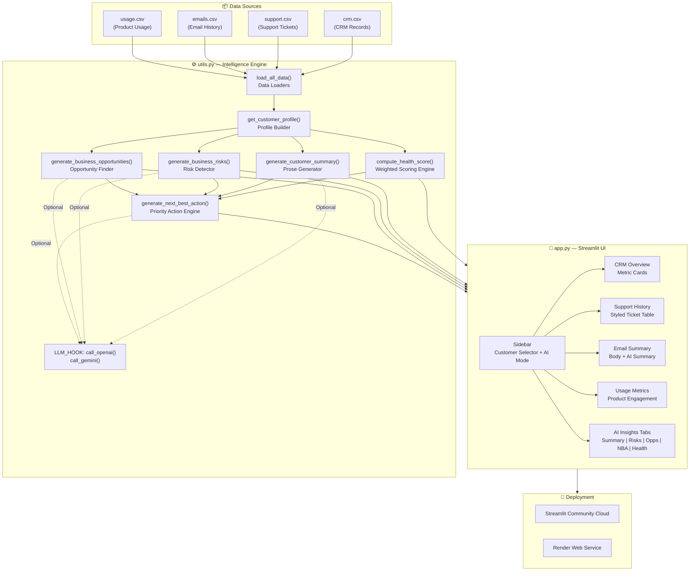

# Customer 360 AI Assistant — Approach Document
**Growth Squad Technical Assessment | Volopay | July 2026**

---

## 1. Problem Statement

Customer Success teams at modern SaaS companies operate across multiple disconnected data systems — CRM platforms, support ticketing tools, email inboxes, and product analytics dashboards. The result is fragmented visibility: a CSM may know a customer's ARR but not their open critical ticket; a support agent may know about an escalation but not that renewal is 14 days away.

This fragmentation leads to reactive account management, missed upsell windows, and avoidable churn.

---

## 2. Business Challenge

| Challenge | Impact |
|---|---|
| No unified account view | CSMs make decisions without full context |
| Manual health assessment | Inconsistent, subjective scoring |
| Reactive escalation | Critical issues surface too late |
| No next-action guidance | Valuable accounts receive generic treatment |
| LLM integration complexity | Teams unsure how to safely add AI to CS workflows |

---

## 3. Solution

**Customer 360 AI Assistant** — a Streamlit application that aggregates four data sources into a single intelligent account view and applies a deterministic rule engine to generate:

- A weighted **Health Score** (0–100) with transparent breakdown
- A prose **Customer Summary** ready for internal briefing
- A prioritized **Business Risks** list
- An **Opportunities** list for upsell and expansion
- A single, context-aware **Next Best Action** with owner and urgency

The engine is fully functional without an API key, and has clearly marked `# LLM_HOOK` integration points for OpenAI GPT-4 or Google Gemini activation.

---

## 4. Architecture Diagram



---

## 5. Workflow

```
1. User selects an account from the sidebar dropdown
2. app.py retrieves cached DataFrames (load_all_data)
3. get_customer_profile() merges all four sources by customer_id
4. compute_health_score() applies weighted rule engine → score + breakdown
5. Four generators produce: Summary, Risks, Opportunities, Next Best Action
6. UI renders all sections with color-coded metrics and styled components
7. (Optional) If API key is set, LLM hooks replace deterministic generators
```

---

## 6. Technology Stack

| Layer | Technology | Version |
|---|---|---|
| UI Framework | Streamlit | ≥ 1.32.0 |
| Data Processing | Pandas | ≥ 2.1.0 |
| Python | CPython | 3.10+ |
| Styling | Custom CSS via `st.markdown` | — |
| Charts | Streamlit native + openpyxl | — |
| LLM (optional) | OpenAI GPT-4o / Google Gemini 1.5 Pro | — |
| Deployment | Streamlit Community Cloud / Render | — |

---

## 7. Prompt Used (LLM Integration)

When LLM mode is activated, the following prompt template is used:

```
You are a Customer Success Manager AI assistant. Based on the following
customer profile data, write a concise 3–4 sentence executive summary
that can be used for internal team briefings.

Customer: {company}
Plan: {plan} | ARR: ${arr:,}
Days to Renewal: {days_to_renewal}
Open Tickets: {open_tickets} | Critical: {critical_tickets}
Health Score: {health_score}/100 ({health_label})
Email Summary: {email_summary}
Feature Adoption Score: {feature_adoption_score}

Focus on:
- Current account status and risk level
- Most urgent action required
- Revenue implications
Keep the tone professional and data-driven.
```

---

## 8. Dummy Data Description

### crm.csv (15 records)
Simulates a B2B SaaS CRM — company names drawn from realistic industries (logistics, fintech, pharma, manufacturing). Plans range from Starter ($12K ARR) to Enterprise ($300K ARR). Renewal dates are within the next 12 months to create urgency scenarios.

### support.csv (20 tickets)
Covers all 15 customers with varying ticket counts (0–2 per customer). Includes Critical, High, Medium, and Low priorities. Sentiment labels (Positive/Neutral/Negative) simulate AI classification output.

### emails.csv (15 records)
One email record per customer. Email bodies are realistic business communication including escalations, renewal inquiries, and positive feedback. Email summaries simulate an LLM-generated extraction.

### usage.csv (15 records)
Monthly product engagement: invoices processed, payments made, active users, API calls, and a composite feature adoption score (0–100) that drives health scoring.

---

## 9. Sample Input

**Customer Selected:** Crimson Media Group (C009)

```
CRM:     Enterprise | ARR: $300,000 | Renewal: 31 Jan 2025 | Owner: Priya Sharma
Support: 2 tickets — both Critical, both Open, both Negative sentiment
Email:   "We have two open critical issues and our team is running out of patience.
          We process $2M+ in payments monthly..."
Usage:   1,243 invoices | 23,450 API calls | Adoption: 95/100
```

---

## 10. Sample Output

**Health Score:** 20/100 — Critical

**Customer Summary:**
Crimson Media Group is on the Enterprise plan with an ARR of $300,000, managed by Priya Sharma. Their renewal is in 42 days, making this an urgent account to prioritize. There are 2 critical support tickets currently open, which presents an escalation risk and requires immediate CSM attention. Overall account health is rated Critical (20/100).

**Top Risk:** 🚨 Critical Support Escalation — 2 critical tickets unresolved at $300K ARR.

**Next Best Action:** Escalate 2 critical tickets to Engineering with VP-level visibility.
- Urgency: 🔴 Immediate (< 24 hrs)
- Owner: Priya Sharma

---

## 11. Future Improvements

| Improvement | Description | Priority |
|---|---|---|
| LLM Integration | Full OpenAI / Gemini activation for narrative insights | High |
| Real CRM Sync | Connect to Salesforce / HubSpot via API | High |
| Predictive Churn Model | ML model trained on historical churn patterns | Medium |
| Email Ingestion | Auto-parse emails from Gmail / Outlook via OAuth | Medium |
| Slack Alerts | Push Next Best Action to CSM's Slack channel | Medium |
| Multi-language Support | Generate summaries in regional languages | Low |
| Mobile Optimization | Responsive layout for field CSM use | Low |
| A/B Testing | Test LLM vs rule-based output quality | Low |

---

*Document prepared for: Volopay Growth Squad Assessment | July 2026*
